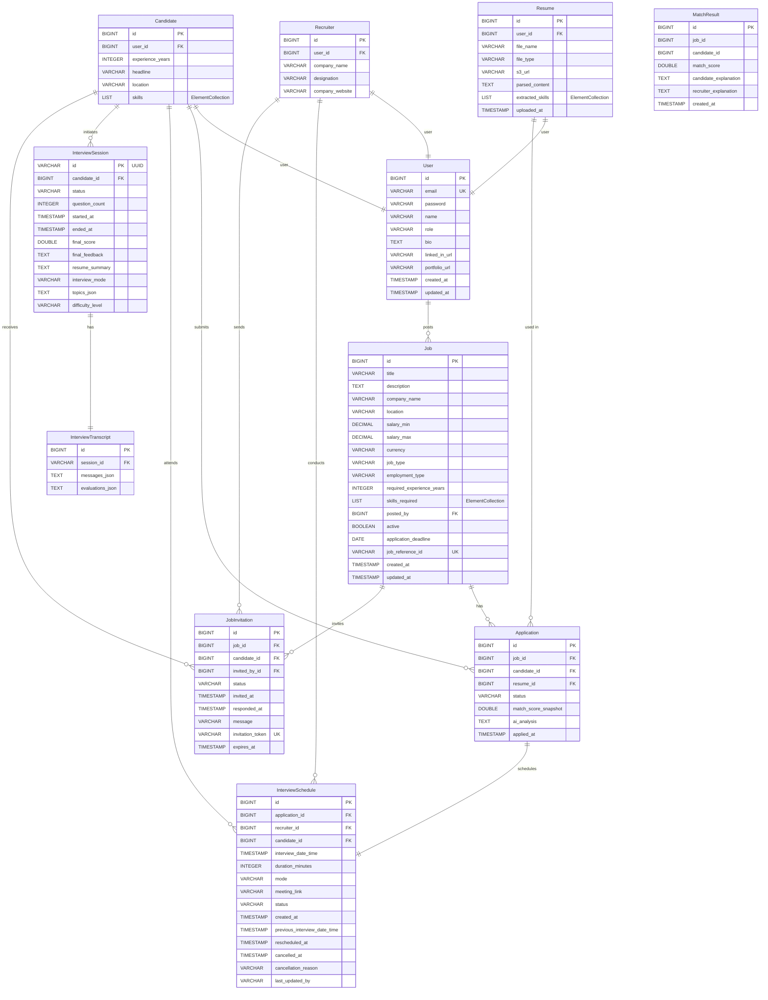
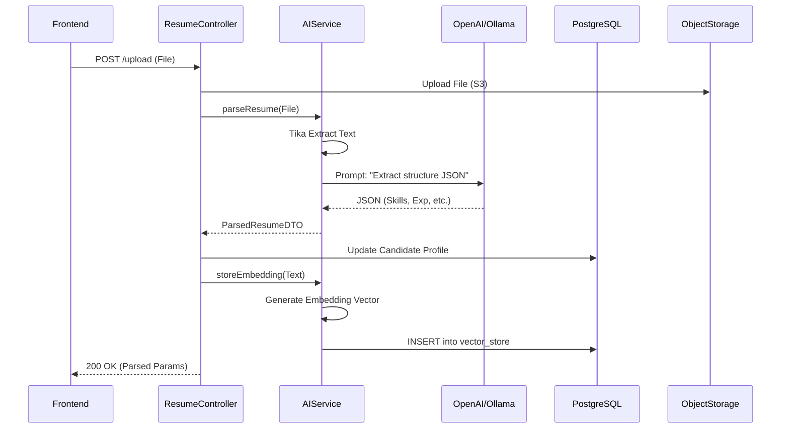
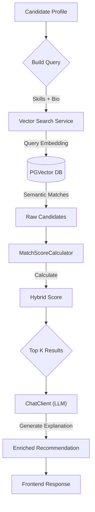
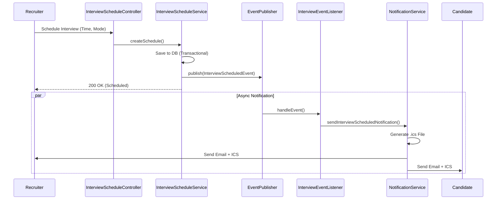

# 🚀 Swagger URL: https://skillsync-ai-backend-production.up.railway.app/swagger-ui/index.html

# 🚀 SkillSync AI

**An AI-powered hiring platform that uses semantic search and intelligent matching to connect the right candidates with the right jobs — automatically.**

---

## 📌 Problem Statement

Traditional hiring platforms rely on keyword-based filtering, which fails to capture the nuance of a candidate's true capabilities. Recruiters manually sift through hundreds of resumes, candidates apply blindly to jobs that don't match their skills, and interviews are scheduled through tedious back-and-forth emails. The process is slow, biased toward keyword-stuffed resumes, and fundamentally broken.

---
## ✨ Key Features

### 🔍 For Candidates
- **AI Job Recommendations**: Get personalized job suggestions based on your resume's skills, experience, and bio, powered by semantic vector search.
- **Smart explanations**: "Why this job?" — receive an AI-generated explanation for every recommendation (e.g., *"This job matches your 3 years of React experience and your preference for remote work"*).
- **🤖 AI Mock Interviews**:
    - **Resume-Based**: Practice answering questions generated specifically from your own resume projects and skills.
    - **Topic-Based**: Choose a topic (e.g., "Java Concurrency") and difficulty level for targeted practice.
    - **Real-time Feedback**: Get instant scoring (1-10), strengths, and areas for improvement after every answer.

### 🎯 For Recruiters
- **Intelligent Candidate Matching**: Instantly find the top N candidates for any job description, ranked by a hybrid score (Semantic Similarity + Experience + Skill Overlap).
- **Automated Outreach**: Send personalized "Invite to Apply" emails to matched candidates with a single click.
- **Interview Scheduling**: seamless scheduling with calendar (.ics) invites and automated email notifications.
- **Dashboard Analytics**: Track application pipelines, interview statuses, and hiring metrics in one place.

---

## 💡 Solution Overview

SkillSync AI reimagines the hiring pipeline with AI at every stage:

- **Resume Parsing** — AI extracts structured data (skills, experience, education) from uploaded resumes using natural language understanding, not regex.
- **Semantic Matching** — Vector embeddings and cosine similarity surface truly relevant candidates, even when exact keywords don't match.
- **AI Mock Interviews** — Candidates practice with an adaptive AI interviewer that generates contextual questions based on their resume and evaluates responses in real-time.
- **Smart Recommendations** — Candidates receive AI-powered job recommendations with natural language explanations of why each job fits their profile.
- **Interview Scheduling** — Recruiters schedule, reschedule, or cancel interviews with automatic email notifications and `.ics` calendar invites.

---

## 📑 Table of Contents

- [📌 Problem Statement](#-problem-statement)
- [💡 Solution Overview](#-solution-overview)
- [🛠️ Tech Stack](#️-tech-stack)
- [✨ Key Features](#-key-features)
- [🗂️ Entity Relationship (ER) Diagram](#️-entity-relationship-er-diagram)
- [🔄 System Flow](#-system-flow)
- [🏗️ System Architecture](#️-system-architecture)
- [🚢 Deployment Architecture](#-deployment-architecture)
- [🧠 AI Architecture](#-ai-architecture)
- [📡 API Documentation](#-api-documentation)
- [🖥️ Local Setup Instructions](#️-local-setup-instructions)
- [🐳 Docker Setup (Full Stack)](#-docker-setup-full-stack)
- [🔐 Environment Variables](#-environment-variables)
- [🔒 Security Implementation](#-security-implementation)
- [🛡️ AI Resilience Strategy](#️-ai-resilience-strategy)
- [🔮 Future Enhancements](#-future-enhancements)
- [🎬 Demo Video](#-demo-video)
- [👨‍💻 Author & Credits](#-author--credits)

---
## 🛠️ Tech Stack

### Backend
| Technology | Version | Purpose |
|---|---|---|
| Java | 21 | Language runtime |
| Spring Boot | 3.5.10 | Application framework |
| Spring AI | 1.1.2 | LLM integration (chat, embeddings, structured output) |
| Spring Security | 6.x | Authentication & authorization |
| Spring Data JPA | — | ORM / data access |
| Spring Mail | — | Email notifications (SMTP) |
| Spring Retry | — | Retry logic for AI calls |
| PostgreSQL | 16 | Relational database |
| pgvector | — | Vector similarity search |
| Apache Tika | — | Document text extraction |
| jjwt | 0.12.5 | JWT token generation & validation |
| ModelMapper | 3.2.0 | DTO ↔ Entity mapping |
| Lombok | — | Boilerplate reduction |
| MinIO Client | 8.5.7 | Object storage client |
| Maven | — | Build tool |

### Frontend
| Technology | Version | Purpose |
|---|---|---|
| React | 19.2 | UI framework |
| Vite | 7.2 | Build tool & dev server |
| React Router | 7.13 | Client-side routing |
| Axios | 1.13 | HTTP client |
| Framer Motion | 12.33 | Animations & transitions |
| React Hot Toast | 2.6 | Toast notifications |

### Infrastructure
| Technology | Purpose |
|---|---|
| Docker + Docker Compose | Containerization |
| Kubernetes | Orchestration (optional) |
| Nginx | Frontend static serving |
| PostgreSQL + pgvector | Database + vector store |
| MinIO | S3-compatible object storage |
| Ollama | Local LLM inference (fallback) |
| OpenRouter | Cloud AI model routing |

---

## 🗂️ Entity Relationship (ER) Diagram

# SkillSync AI Database Schema

Below is the complete Entity Relationship Diagram for the platform.



---

## 🏗️ System Architecture

### Backend — Layered Design

```
┌───────────────────────────────────────────────┐
│                 Controller Layer               │
│  AuthController · JobController · UserController│
│  ResumeController · InterviewController · ...  │
├───────────────────────────────────────────────┤
│                 Service Layer                  │
│  (Interface + Impl for all 16 services)        │
│  AIService · JobMatchingService · VectorSearch │
│  InterviewAiService · NotificationService · ...│
├───────────────────────────────────────────────┤
│               Repository Layer                 │
│  Spring Data JPA Repositories                  │
├───────────────────────────────────────────────┤
│                Entity Layer                    │
│  User · Candidate · Recruiter · Job · Resume   │
│  Application · MatchResult · InterviewSchedule │
│  InterviewSession · InterviewTranscript · ...  │
├───────────────────────────────────────────────┤
│              Infrastructure                    │
│  PostgreSQL + pgvector · Spring Security/JWT   │
│  Spring Mail · Spring AI · Apache Tika         │
└───────────────────────────────────────────────┘
```

### Frontend–Backend Interaction
- React frontend communicates via **REST API** over HTTP (Axios)
- JWT tokens stored in `localStorage`, attached via Axios request interceptor
- Role-based routing: separate dashboard layouts for **Candidate** and **Recruiter**
- API modules: `authAPI`, `userAPI`, `jobsAPI`, `applicationsAPI`, `invitationsAPI`, `mockInterviewAPI`

### Storage Architecture
- **PostgreSQL** (pgvector/pg16) — relational data + vector embeddings in a single database (`vectordb`)
- **pgvector extension** — initialized via `init-db.sql` (`CREATE EXTENSION IF NOT EXISTS vector`)
- **Resume files** — stored in **MinIO** (S3-compatible object storage)
- **Vector Store** — `PgVectorStore` managed by Spring AI for automatic embedding storage and similarity search

---

## � System Flow

### 1. High-Level System Flow
```ascii
[React Frontend]
      |
      | REST API (JSON)
      v
[Spring Boot Backend]
      |
      +---> [AuthController] -> [AuthService] -> [PostgreSQL (Users/Roles)]
      |
      +---> [ResumeController] -> [AIService] 
      |           |
      |           +---> [OpenAI / Ollama] (LLM Parsing)
      |           +---> [MinIO] (Object Storage)
      |           +---> [PGVector] (Embeddings)
      |
      +---> [JobController] -> [JobService] -> [PostgreSQL (Jobs)]
      |
      +---> [RecommendationController] -> [VectorSearchService] 
      |           |
      |           +---> [PGVector] (Similarity Search)
      |           +---> [ChatClient] (AI Explanation)
      |
      +---> [InterviewScheduleController] 
                  |
                  v
          [InterviewScheduleService] --(Event)--> [InterviewEventListener]
                                                         |
                                                         v
                                                [NotificationService]
                                                         |
                                                         v
                                                [JavaMailSender] -> [Email + ICS]
```

### 2. Backend Request Flow (Resume Upload)


### 3. AI Matching Flow


### 4. Interview Scheduling & Notification


---

## �🚢 Deployment Architecture

### Docker Compose (Full Stack)

| Service      | Image / Build                | Port   |
|-------------|------------------------------|--------|
| **postgres** | `pgvector/pgvector:pg16`     | `5454` |
| **backend**  | Multi-stage Maven + Corretto 21 | `9090` |
| **ollama**   | `ollama/ollama:latest`       | `11434`|
| **minio**    | `minio/minio:latest`         | `9000` |
| **frontend** | Multi-stage Node 20 + Nginx  | `5173` |

- Backend waits for PostgreSQL health check before starting
- Persistent volumes for PostgreSQL data and Ollama models
- Environment variables injected from `.env` file

### Kubernetes
K8s manifests provided for:
- `postgres.yaml` — PostgreSQL StatefulSet with PVC
- `backend.yaml` — Spring Boot Deployment + Service
- `frontend.yaml` — Nginx-served React app + Service

### Cloud Deployment
For step-by-step instructions on deploying the full stack to Railway, see:
👉 **[RAILWAY_DEPLOY.md](RAILWAY_DEPLOY.md)**

- **Frontend**: Deployable to **Vercel** or **Railway** (static build output from Vite)
- **Backend**: Containerized with multi-stage Dockerfile (Amazon Corretto 21 Alpine)

---

## 🧠 AI Architecture

### Resume Parsing
Resumes (PDF, DOCX) are processed through **Apache Tika** for text extraction, then sent to an LLM to extract structured data:
- Full name, email, skills list, years of experience, education summary, professional summary
- Output is mapped to a typed `ParsedResumeDTO` using Spring AI's structured output (entity extraction)

### Embeddings & Semantic Search
- Resume content is embedded using **OpenAI embedding models** and stored in **PostgreSQL with pgvector**
- Job descriptions are also embedded and stored in the vector store with `docType` metadata (`RESUME` or `JOB`)
- **Similarity search** uses `SearchRequest` with configurable `topK`, `similarityThreshold`, and `FilterExpression` to find relevant matches
- This enables true semantic matching — "React developer" matches candidates with "frontend engineering" experience, even without exact keyword overlap

### Match Score Calculation
A **hybrid scoring model** combines:
- **Skill overlap** (75% weight) — fuzzy substring matching between job requirements and candidate skills
- **Experience alignment** (25% weight) — proportional scoring based on required vs. actual experience
- Base score of 30% ensures minimum visibility; total score is capped at 100%

### AI-Powered Explanations
- Candidates receive **natural language explanations** of why a job was recommended, generated by the LLM using their profile and the job description
- Fallback from OpenAI to Ollama is built in

### AI Mock Interviews
- **Resume-based** — AI generates questions tailored to the candidate's skills and experience level
- **Topic-based** — candidate selects topics and difficulty; AI generates contextual questions
- Each answer is evaluated in real-time with a JSON-structured response: `score (0–10)`, `strengths`, `weaknesses`
- After 5 questions, AI generates a final feedback summary

### AI Fallback Strategy
Every AI call follows a **primary → fallback** pattern:
1. **Primary**: OpenAI-compatible API (configured via OpenRouter for flexible model routing)
2. **Fallback**: Local **Ollama** instance (default model: `gemma3:latest`)
3. **Retry**: Spring Retry with `@EnableRetry` handles transient failures (rate limits, timeouts)

---

## 📡 API Documentation

> Base URL: `http://localhost:9090/api`
> All endpoints except those marked 🌐 (Public) require a valid JWT token in the `Authorization: Bearer <token>` header.

---

### 🔐 Authentication

| Method | Endpoint | Role | Description |
|--------|----------|------|-------------|
| `POST` | `/api/auth/login` | 🌐 Public | Authenticate with email and password; returns JWT token and user details |

---

### 👤 Users

| Method | Endpoint | Role | Description |
|--------|----------|------|-------------|
| `POST` | `/api/users` | 🌐 Public | Register a new user account (CANDIDATE or RECRUITER role) |
| `GET` | `/api/users/me` | Authenticated | Get the currently logged-in user's profile information |
| `GET` | `/api/users/{id}` | Authenticated | Fetch a specific user's details by their ID |
| `GET` | `/api/users` | Authenticated | List all registered users in the system |
| `PUT` | `/api/users/{id}` | Authenticated | Update a user's profile (name, bio, LinkedIn URL, etc.) |
| `DELETE` | `/api/users/{id}` | Authenticated | Delete a user account permanently |

---

### 📄 Resumes

| Method | Endpoint | Role | Description |
|--------|----------|------|-------------|
| `POST` | `/api/resumes/upload` | CANDIDATE | Upload a resume file (PDF/DOCX); AI parses it, extracts skills/experience, stores embedding in vector DB |
| `DELETE` | `/api/resumes/me` | CANDIDATE | Delete the current candidate's resume (blocked if resume is linked to active applications) |
| `GET` | `/api/resumes/download/{resumeId}` | Authenticated | Download a resume file by its ID as an attachment |

---

### 💼 Jobs

| Method | Endpoint | Role | Description |
|--------|----------|------|-------------|
| `POST` | `/api/jobs` | RECRUITER | Create a new job posting (requires 100% profile completion) |
| `GET` | `/api/jobs` | Authenticated | List all active job postings |
| `GET` | `/api/jobs/{id}` | Authenticated | Get full details of a specific job |
| `GET` | `/api/jobs/my` | RECRUITER | List all jobs posted by the authenticated recruiter |
| `PUT` | `/api/jobs/{id}` | RECRUITER | Update an existing job posting (owner only) |
| `DELETE` | `/api/jobs/{id}` | RECRUITER | Delete a job posting (owner only) |
| `GET` | `/api/jobs/search` | 🌐 Public | Search jobs by keyword query (title, description, skills) |
| `GET` | `/api/jobs/filter` | Authenticated | Filter jobs by type, employment type, location, salary range, and skill |
| `PATCH` | `/api/jobs/{id}/status` | RECRUITER | Toggle a job's active/inactive status (owner only) |

---

### 📋 Applications

| Method | Endpoint | Role | Description |
|--------|----------|------|-------------|
| `POST` | `/api/jobs/{jobId}/apply` | CANDIDATE | Apply for a job with an uploaded resume |
| `GET` | `/api/candidates/me/applications` | CANDIDATE | List all job applications submitted by the current candidate |
| `GET` | `/api/candidates/me/interviews` | CANDIDATE | List all scheduled interviews for the current candidate |
| `GET` | `/api/recruiter/jobs/{jobId}/applications` | RECRUITER | View all applications for a specific job, optionally filtered by status |
| `GET` | `/api/recruiter/applications` | RECRUITER | View all applications across all jobs posted by the recruiter |
| `GET` | `/api/recruiter/stats` | RECRUITER | Get dashboard statistics (total jobs, applications, shortlisted, interviews) |
| `PATCH` | `/api/applications/{applicationId}/status` | RECRUITER | Update an application's status (e.g., REVIEWED, REJECTED, OFFERED) |
| `PATCH` | `/api/applications/{applicationId}/shortlist` | RECRUITER | Shortlist a candidate's application for further review |

---

### 📅 Interview Scheduling

| Method | Endpoint | Role | Description |
|--------|----------|------|-------------|
| `POST` | `/api/applications/{applicationId}/schedule-interview` | RECRUITER | Schedule an interview for a shortlisted candidate (sends email + .ics calendar invite) |
| `PATCH` | `/api/interviews/{interviewId}/reschedule` | RECRUITER | Reschedule an existing interview to a new date/time (sends updated notification) |
| `PATCH` | `/api/interviews/{interviewId}/cancel` | RECRUITER | Cancel a scheduled interview with a reason (reverts application to SHORTLISTED) |
| `GET` | `/api/recruiter/jobs/{jobId}/interviews` | RECRUITER | List all scheduled interviews for a specific job |
| `GET` | `/api/recruiter/interviews` | RECRUITER | List all scheduled interviews across all recruiter's jobs |

---

### 🤖 AI Mock Interviews

| Method | Endpoint | Role | Description |
|--------|----------|------|-------------|
| `POST` | `/api/interviews/mock/start` | CANDIDATE | Start a resume-based mock interview; AI generates the first question from candidate profile |
| `POST` | `/api/interviews/mock/topic/start` | CANDIDATE | Start a topic-based mock interview with custom topics and difficulty level |
| `POST` | `/api/interviews/mock/{sessionId}/answer` | CANDIDATE | Submit an answer to the current question; AI evaluates with score, strengths, and weaknesses |
| `POST` | `/api/interviews/mock/{sessionId}/end` | CANDIDATE | End the interview session early; AI generates final feedback summary |
| `GET` | `/api/interviews/mock/{sessionId}/transcript` | CANDIDATE | Retrieve the full Q&A transcript with evaluations for a completed session |
| `GET` | `/api/interviews/mock/history` | CANDIDATE | List all past completed mock interview sessions with scores |

---

### 🎯 AI Job Matching (Recruiter)

| Method | Endpoint | Role | Description |
|--------|----------|------|-------------|
| `GET` | `/api/jobs/{jobId}/matches` | RECRUITER | Find top matching candidates for a job using vector similarity search + hybrid scoring |

---

### 💡 AI Job Recommendations (Candidate)

| Method | Endpoint | Role | Description |
|--------|----------|------|-------------|
| `GET` | `/api/candidates/me/recommended-jobs` | CANDIDATE | Get AI-powered job recommendations based on resume embeddings; filterable by score threshold and location |
| `GET` | `/api/candidates/me/recommended-jobs/{jobId}/explanation` | CANDIDATE | Get an AI-generated natural language explanation of why a specific job is recommended |

---

### 📩 Job Invitations

| Method | Endpoint | Role | Description |
|--------|----------|------|-------------|
| `POST` | `/api/jobs/{jobId}/invite` | RECRUITER | Invite a matched candidate to apply for a job (sends email notification with invite link) |
| `GET` | `/api/candidates/me/invitations` | CANDIDATE | List all job invitations received by the current candidate |
| `POST` | `/api/invitations/{token}/accept` | CANDIDATE | Accept a job invitation using the secure token; auto-creates a job application |
| `POST` | `/api/invitations/{token}/decline` | CANDIDATE | Decline a job invitation using the secure token |

---

## 🖥️ Local Setup Instructions

### Prerequisites
- Java 21 (JDK)
- Node.js 20+
- Maven 3.9+
- Docker & Docker Compose
- PostgreSQL 16 with pgvector extension **or** use Docker
- MinIO Server (local or container)

### 1. Clone the Repository
```bash
git clone https://github.com/Prathamesh36/SkillSync-AI.git
cd SkillSync-AI
```

### 2. Start Infrastructure (Database + Ollama)
```bash
cd SkillSync-AI
docker compose up -d postgres ollama minio
```

### 3. Configure Environment Variables
```bash
cp .env.example .env
# Edit .env with your actual values
```

### 4. Run the Backend
```bash
cd SkillSync-AI
mvn spring-boot:run
```
Backend starts on `http://localhost:9090`

### 5. Run the Frontend
```bash
cd skillsync-ai-frontend
npm install
npm run dev
```
Frontend starts on `http://localhost:5173`

---

## 🐳 Docker Setup (Full Stack)

```bash
cd SkillSync-AI

# Create .env file with required variables
cp .env.example .env

# Build and run all services
docker compose up --build -d
```

This starts:
- **PostgreSQL** (pgvector) on port `5454`
- **Ollama** on port `11434`
- **MinIO** on port `9000` (Console: `9001`)
- **Backend** on port `9090`
- **Frontend** on port `5173`

---

## 🔐 Environment Variables

| Variable | Description | Required |
|---|---|---|
| `OPENAI_API_KEY` | API key for OpenRouter / OpenAI-compatible endpoint | ✅ |
| `MAIL_USERNAME` | Gmail address for sending notifications | ✅ |
| `MAIL_PASSWORD` | Gmail app-specific password | ✅ |
| `SPRING_AI_OLLAMA_BASE_URL` | Ollama base URL (default: `http://localhost:11434`) | Optional |
| `SPRING_DATASOURCE_URL` | PostgreSQL JDBC URL (default: `jdbc:postgresql://localhost:5454/vectordb`) | Optional |
| `SPRING_DATASOURCE_USERNAME` | Database username (default: `root`) | Optional |
| `SPRING_DATASOURCE_PASSWORD` | Database password (default: `root`) | Optional |
| `MINIO_ENDPOINT` | MinIO server URL (default: `http://localhost:9000`) | ✅ |
| `MINIO_ACCESS_KEY` | MinIO access key | ✅ |
| `MINIO_SECRET_KEY` | MinIO secret key | ✅ |

---

## 🔒 Security Implementation

### JWT Authentication
- Stateless authentication using **JWT tokens** (jjwt 0.12.5)
- `JwtTokenProvider` handles token generation and validation
- `JwtAuthenticationFilter` intercepts every request and sets the security context
- Tokens transmitted via `Authorization: Bearer <token>` header

### Role-Based Access Control
- Two roles: **CANDIDATE** and **RECRUITER**
- `@EnableMethodSecurity` enables method-level authorization
- Public endpoints: `/api/auth/**`, `/api/jobs/search`, `POST /api/users`
- All other endpoints require authentication
- `CustomUserDetailsService` loads users from the database for authentication

### CORS Configuration
- Configured allowed origins for local development and Kubernetes NodePort access
- Supports all standard HTTP methods with credential forwarding
- Preflight responses cached for 1 hour

### Secure Password Storage
- Passwords hashed with **BCrypt** (`BCryptPasswordEncoder`)

---

## 🛡️ AI Resilience Strategy

```
┌──────────────┐     Fail     ┌──────────────┐     Fail     ┌──────────────┐
│   OpenRouter  │ ──────────► │    Ollama     │ ──────────► │  Graceful     │
│  (Cloud AI)   │             │  (Local LLM)  │             │  Degradation  │
└──────────────┘             └──────────────┘             └──────────────┘
       │                            │
       └──── Spring Retry ──────────┘
             (Rate limit / Timeout handling)
```

- **Primary**: OpenAI-compatible API via OpenRouter (`openrouter/free` model)
- **Fallback**: Local Ollama instance with `gemma3:latest`
- **Retry**: Spring Retry with `@EnableRetry` for transient failures
- **Parsing resilience**: If AI extraction fails, both providers are attempted before throwing
- **Evaluation resilience**: JSON parsing of AI responses includes fallback defaults if malformed

---

## 🔮 Future Enhancements

- [ ] Real-time chat between recruiters and candidates (WebSocket)
- [ ] Video interview integration (WebRTC)
- [ ] Advanced analytics dashboard with hiring funnel metrics
- [ ] Resume builder with AI suggestions
- [ ] Multi-language support for global hiring
- [ ] OAuth 2.0 social login (Google, LinkedIn)
- [ ] Swagger/OpenAPI documentation endpoint
- [x] S3/MinIO integration for cloud resume storage (Completed)
- [ ] Rate limiting and API throttling
- [ ] Candidate skill assessment modules

---

## 🎬 Demo Video

> 📹 [Watch the demo video](#) *(link to be added)*

---

## 👨‍💻 Author & Credits

**Prathamesh Patil**

Built as part of the **CodingShuttle Hackathon** — AI-Powered Online Hiring Platform.

| | |
|---|---|
| **GitHub** | [Prathamesh36](https://github.com/Prathamesh36) |
| **Project** | [SkillSync-AI](https://github.com/Prathamesh36/SkillSync-AI) |

---

<p align="center">
  Built with ☕ Spring Boot, ⚛️ React, and 🤖 Spring AI
</p>
